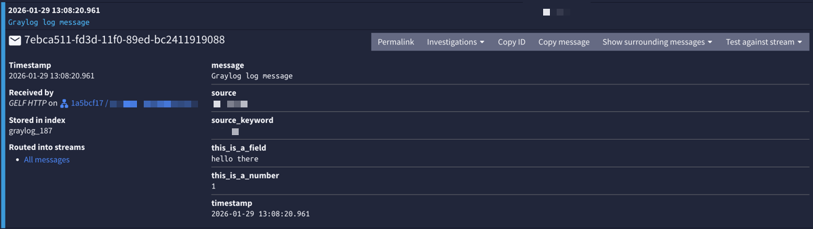

# What is this?

This is a proof of concept and example of how to use Powershell to send ad-hoc log messages to Graylog, using GELF HTTP.

# How to use?

See `Example.ps1`.

Include `Send-Gelf.ps1` (or copy the function into your own script) and call it:

```ps1
# declare gelf uri var
$gelf_uri = "http://graylog.domain.tld:12201/gelf"

# declare json body var
$body = @{
    host = $env:computername
    message = "Graylog log message"
    this_is_a_field = "hello there"
    this_is_a_number = 1
} | ConvertTo-Json -Compress

# send gelf payload
Send-Gelf -uri $gelf_uri -json_body $body 
```

This will send a log message to Graylog that looks like this:



Additonal fields can be added to the JSON payload. However, GELF mandates the following fields be included in every payload. Otherwise Graylog will reject the message.

- `host` (or `source`): The device sending the log message. Typically the hostname.
- `message`: The log message payload

It may also be advantageous to add a `timestamp` field with your payload. While not required (meaning graylog itself will append the timestamp that it processed the log), if there is a gap between graylog receiving your message and procesing it, the logged timestamp will not match the true timestamp the log was sent.

# Disclaimer

THE SOFTWARE IS PROVIDED “AS IS”, WITHOUT WARRANTY OF ANY KIND, EXPRESS OR IMPLIED, INCLUDING BUT NOT LIMITED TO THE WARRANTIES OF MERCHANTABILITY, FITNESS FOR A PARTICULAR PURPOSE AND NONINFRINGEMENT. IN NO EVENT SHALL THE AUTHORS OR COPYRIGHT HOLDERS BE LIABLE FOR ANY CLAIM, DAMAGES OR OTHER LIABILITY, WHETHER IN AN ACTION OF CONTRACT, TORT OR OTHERWISE, ARISING FROM, OUT OF OR IN CONNECTION WITH THE SOFTWARE OR THE USE OR OTHER DEALINGS IN THE SOFTWARE.