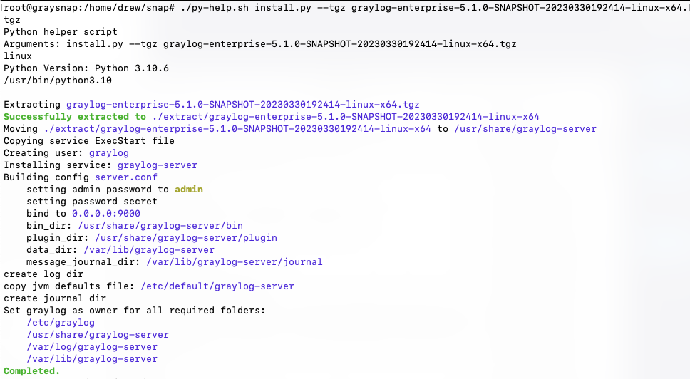

# What is this?

This is an "installer" for graylog using a `.tgz` build or snapshot.

Its intention is to be used with snapshot builds since official releases can be installed via linux packages.

# Prerequisites

* Python >= 3.9
* Graylog `.tgz` release
* [OpenSearch installed](https://github.com/Graylog2/se-poc-docs/blob/main/src/On%20Prem%20POC/installing%20opensearch.md) and running (Graylog will attempt to connect via `http://127.0.0.1:9200`)
* [MongoDB](https://github.com/Graylog2/se-poc-docs/blob/main/src/On%20Prem%20POC/installing%20mongodb.md) installed and running (Graylog will attempt to connect via `mongodb://localhost/graylog`)

# Instructions

## Preparation

* Upload all files in this directory to server where graylog will be installed
* Upload graylog `.tgz` release file

## Installation

Elevate to root:

```shell
sudo su
```

Enable execution for `py-help.sh`

```shell
chmod +x py-help.sh
```

Execute:

```shell
./py-help.sh install.py --tgz <filename.tgz>
```

Important info:

* Web Interface listens on HTTP port 9000
* Admin login info:
    * username: admin
    * password: admin

Sample output: 